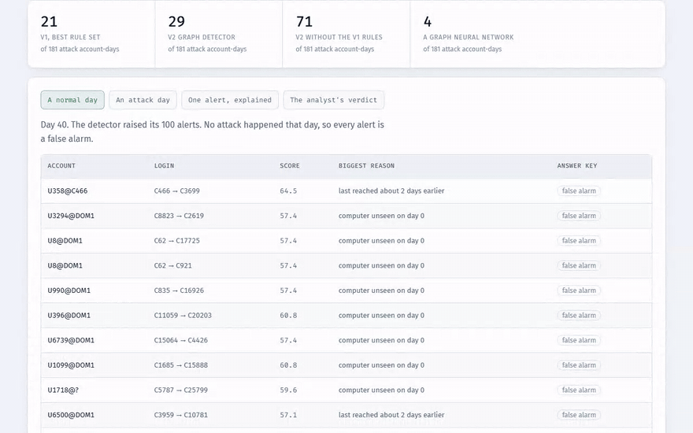
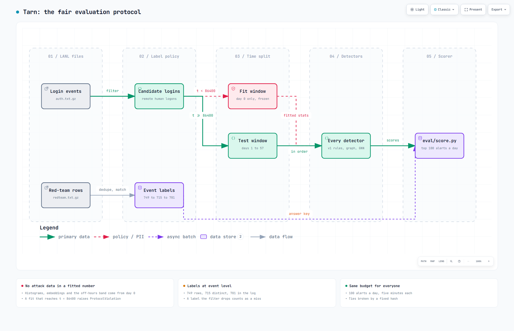
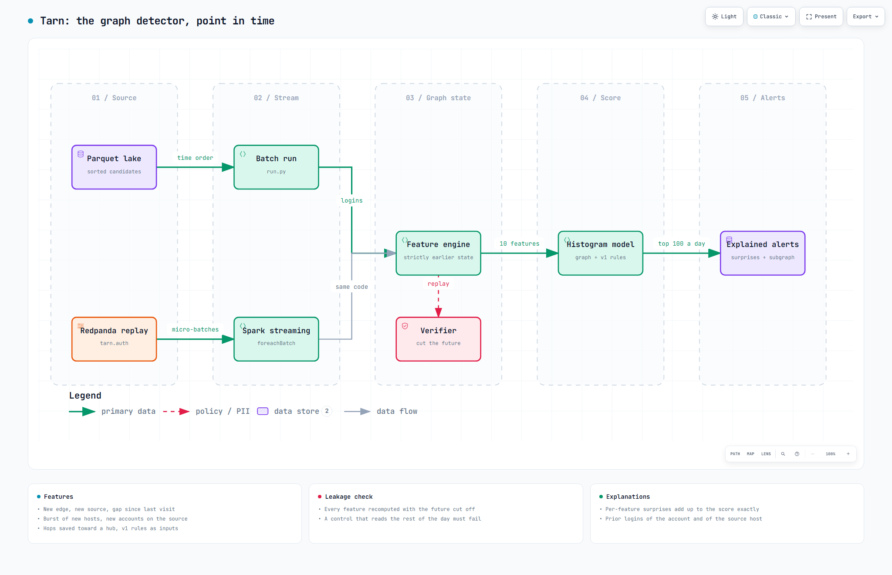
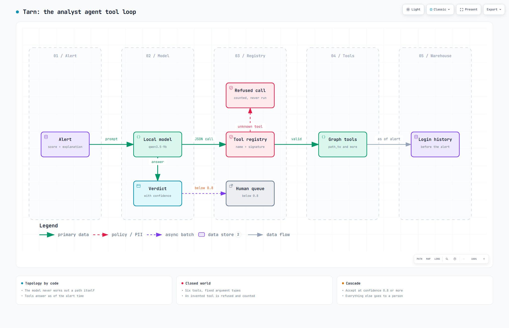

# Tarn

Tarn takes a billion real login records from a US national lab, where 749 are a known attack, and asks one question: would this have caught the attacker? A map of who logged into which computer is scored as each login arrives and raises alerts. Then an AI analyst with map tools sorts those alerts so a person only reads the ones that matter. Every result below is checked against the lab's answer key, including the ones that came out badly.

### [Open the demo](https://samad-zeeshan.github.io/Tarn/)


A 90-second walkthrough is in [docs/demo.webm](docs/demo.webm). The page replays recorded runs, and its SQL box runs live in your browser once you scroll to it.

## How it works


Every detector learns only from day 0, is tested on days 1 to 57, and gets the same 100 alerts a day.


Each login is scored only from earlier logins, batch and Spark streaming share the same code, and a verifier cuts off the future to prove it.


A local model reads each alert, asks graph questions through a closed tool registry, and hands anything it is unsure of to a person.

The v1 platform underneath (Spark lake, dbt and DuckDB warehouse, Redpanda streaming, Neo4j graph) is drawn in [docs/diagrams/](docs/diagrams/), each PNG with an interactive HTML next to it.

## Results

Every number comes from the full LANL log (1,051,430,459 events), from a local lake built from `auth.txt.gz` and `redteam.txt.gz`, written to `eval/results/`. CI runs the same code on a committed 99,434-event slice and fails if these tables drift from those files.

**Fair evaluation.** The red-team file has 749 rows, but only 715 distinct events, and 14 of those never appear in the login log, so 701 can be found. v1's rules re-scored on the test days, with its one learned setting (the quiet-hours band) re-learned from day 0:

<!-- results:v1 -->
| v1 rule | v1 README: caught, alerts | fair protocol: caught, alerts | attack logins covered |
|---|---|---|---|
| Q3 new access paths | 56 of 181, 33,319 | 56 of 181, 17,537 | 448 of 701 |
| Q1 fan-out spike | 20 of 181, 21,136 | 20 of 181, 21,136 | 245 of 701 |
| Q4 failure spike | 11 of 181, 5,752 | 11 of 181, 5,752 | 146 of 701 |
| Q2 off-hours | 0 of 181, 6,379 | 1 of 181, 6,852 | 8 of 701 |
| Any of the four | 62 of 181, 63,891 | 62 of 181, 48,813 | 472 of 701 |
| Two or more | 22 of 181, 2,599 | 23 of 181, 2,414 | 267 of 701 |
<!-- /results -->

Alert counts drop because day 0, where every login looks new, is no longer scored. The same code over all 58 days reproduces v1's published table exactly. **Graph detector.** 100 alerts a day for every detector, about 8 analyst hours at five minutes an alert. Account-day alerts cover one account's logins for a day. Single-login alerts are one login each.

<!-- results:budget -->
| detector, 100 alerts a day | attack account-days caught | attack logins covered | single-login alerts: attack logins caught | average precision |
|---|---|---|---|---|
| v1, rules ranked by how many fired | 21 of 181 | 256 of 701 | n/a | n/a |
| v2 graph detector (fixed in advance) | 29 of 181 | 246 of 701 | 1 of 701 | 0.00013 |
| v2 without the v1 rules | 71 of 181 | 436 of 701 | 7 of 701 | 0.00162 |
| LightGCN graph neural network | 4 of 181 | 8 of 701 | 0 of 701 | 0.00002 |
| v1 rules alone, as login features | 2 of 181 | 4 of 701 | 0 of 701 | 0.00000 |
<!-- /results -->

**Point-in-time check.** Features recomputed with the future cut off at 25 random seconds, 300 seeded accounts, days 0 to 9:

<!-- results:verifier -->
| engine | features checked | mismatches | verdict |
|---|---|---|---|
| v2 feature engine | 5,079,642 | 0 | pass |
| control that looks an hour ahead | 5,079,642 | 478 | fails, as it should |
<!-- /results -->

**Analyst agent.** qwen3.5-9b in LM Studio with reasoning off, run on a laptop and committed. The benchmark holds 600 alerts from the detector's wider feed of 1,000 a day, with answers worked out by code from the labels. The agent ran twice, once with graph tools and once without, and both runs answered all 600 alerts.

<!-- results:analyst -->
| 600 of 600 alerts scored, 51 of them attacks | with graph tools | without |
|---|---|---|
| right, when it decided | 88.2% | 89.8% |
| handed to a person | 0.8% | 0.0% |
| attacks closed as false alarms at confidence 0.8 or more | 33 | 47 |
| launch host and path right, on attacks | 49.0% | 5.9% |
| calibration error (ECE, lower is better) | 0.07 | 0.05 |
| tool calls, invented calls refused, tokens per alert | 5.2, 0, 7,489 | 2.5, 0, 2,775 |
| analyst hours a day for the 1,000-a-day feed, before and after the agent | 83 to 0 | 83 to 0 |
| attack alerts still called attacks or passed to a person | 35.3% | 7.8% |
<!-- /results -->

## What the numbers say

- The detector I fixed in advance, graph features plus v1's rules, finds more attack account-days than v1's best rules at the same budget but covers slightly fewer attack logins. A narrow win on one measure.
- The same detector without v1's rules does much better. The quiet-hours rule pushes ordinary night logins to the top. I found this after scoring, so it is an ablation, not the headline.
- As single-login alerts everything is poor. The attack makes hundreds of logins on its busiest day, and 100 slots hold few of them.
- The graph neural network, trained on day 0 alone, is close to useless. A fifth of test logins involve an account or computer day 0 never saw.
- The agent is not good enough to trust on its own. With graph tools it still closed 33 of the 51 attack alerts as false alarms. Without them it closed 47. So the graph tools help, but the agent still lost most attacks. It said it was about 95 percent sure almost every time and passed only 5 alerts to a person, and those 5 were replies it failed to finish, not doubts. The drop in analyst hours above only holds if losing most attacks is acceptable, and it is not.

## What this does not show

- One network, one red team, one answer key, and every learned setting comes from one attack-free day. A real system would retrain.
- Five minutes per alert is an assumption. The agent only sees alerts the detector ranked, so attacks the detector missed never reach it.

## Design decisions

Everything learned is fitted on day 0, and a fit that reaches t = 86,400 raises an error in `eval/protocol.py`. Batch, streaming and the verifier share one feature engine, `detect/graph/features.py`, and logins in the same second never see each other. The score is a sum of per-feature surprises, so each explanation adds up to its alert's score exactly. The agent's tools sit behind a closed registry: a call runs only if the tool exists and its arguments match, and invented calls are counted and never run.

## Run it

```bash
docker compose up -d && make test
python detect/graph/extract.py --lake /data/lake --out /data/work/v2 && python detect/graph/run.py --work /data/work/v2 --out /data/work/v2/out
python eval/score.py --work /data/work/v2 --scores /data/work/v2/out --warehouse /data/work/tarn.duckdb --lake /data/lake --data-label full
```

Tests need only the committed slice. The full corpus is behind LANL's form at <https://csr.lanl.gov/data/cyber1/> (`make fetch`).

## Papers

- arXiv 2607.29390, fair evaluation of graph-based lateral movement detectors (the protocol)
- arXiv 2608.23468, RAD, rule-augmented relational anomaly detection (v1 rules as inputs)
- arXiv 2609.18107, FoundAna (not run: needs PyTorch and pretrained weights, so LightGCN stands in)
- arXiv 2608.15559, explanation with exact preservation for dynamic graph detectors
- arXiv 2609.15614, tractable defense against advanced persistent threats (lateral movement framing)
- arXiv 2608.22389, KONTOGRAPH, verified point-in-time features (the verifier)
- arXiv 2609.04159, SENTINEL-RL, topology reasoning moved out of the LLM (graph tools)
- arXiv 2609.30055, Era by Eon, agent benchmarks on hidden knowledge (benchmark shape)
- arXiv 2609.19425, closed-world resolution against tool hallucination (the registry)
- arXiv 2609.26550, JEV-as-a-Judge, accept when confident, escalate when unsure (the cascade)
- arXiv 2609.26489, calibration as a first-class criterion in LLM evaluation

## Licence and data

MIT. Data: A. D. Kent, *Comprehensive, Multi-Source Cyber-Security Events*, Los Alamos National Laboratory (2015), public domain (CC0), <https://csr.lanl.gov/data/cyber1/>. Users and computers are pseudonyms.
